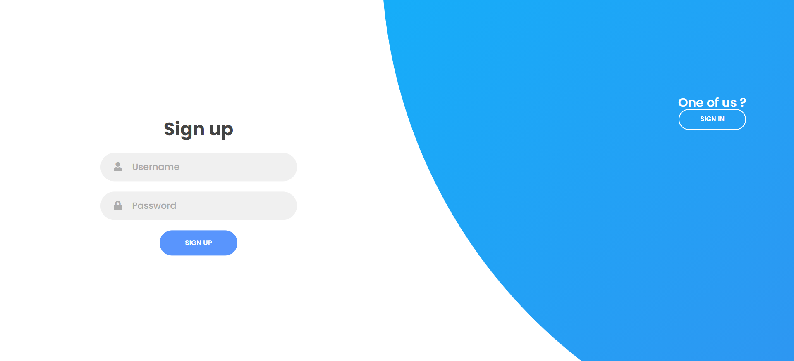
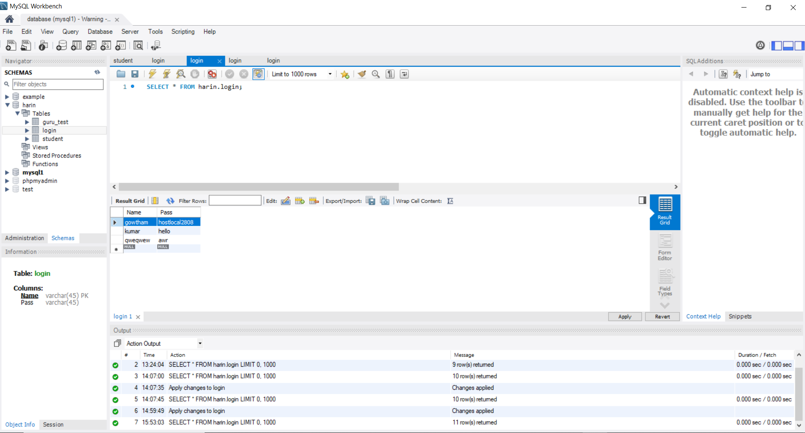
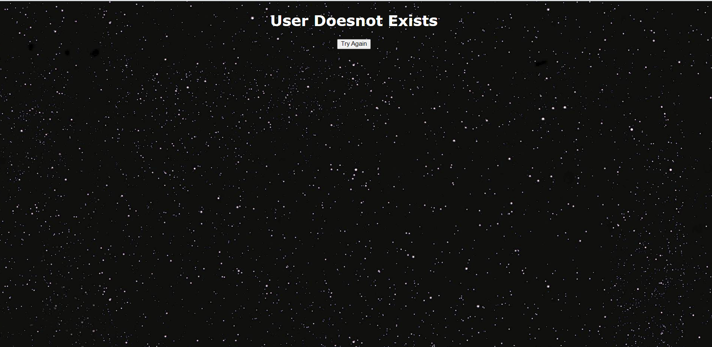
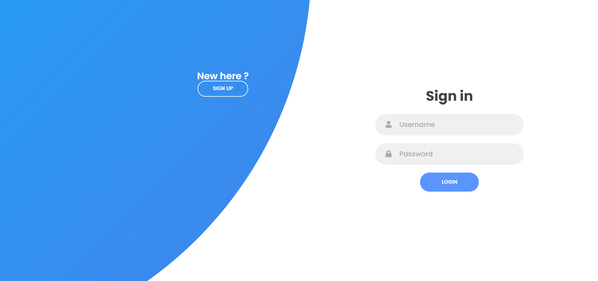

# Responsive Login-page
A Simple Responsive Login Page which stores and retrives login data from MySql database.

📖-**Instructions**
* Install Apache Tomacat server v7.0 or later.
* Install MySql and configure.
* Download JSTL-1.2.jar file and mysql-connector-java-8.0.16 .
* Open the downloaded files in eclipse .
* Right click the project folder in eclipse ,select BuildPath -> configure BuildPath ->add both the jstl.jar and mysql-connector files.
* Run index.html file using tomcat server.

📸-**Screenshots**

&nbsp;

&nbsp;

&nbsp;

🛠-**Build With**
*HTML,CSS,JS
*JSP,JSTL
*MYSQL.
